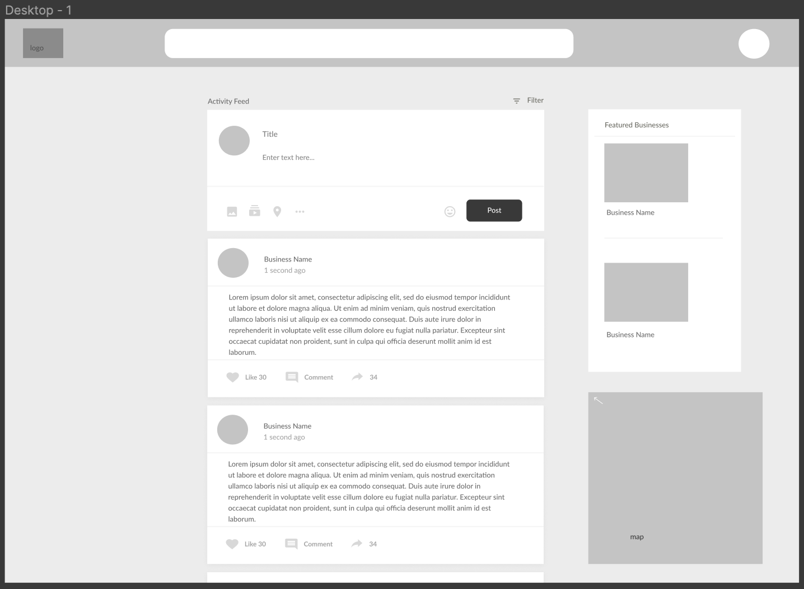
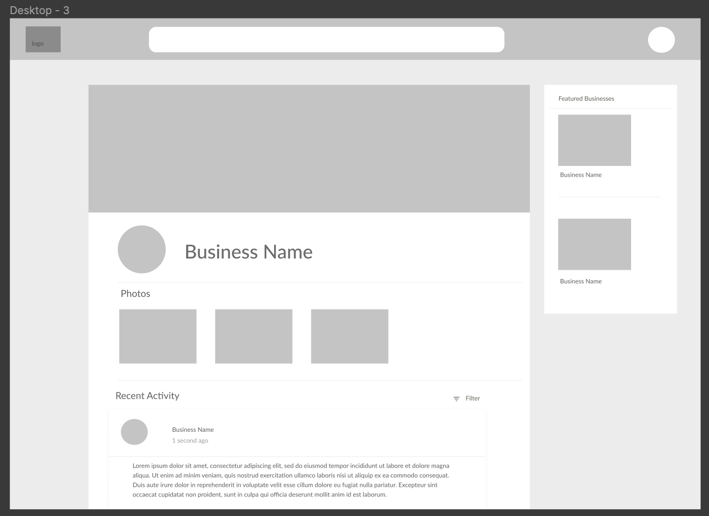
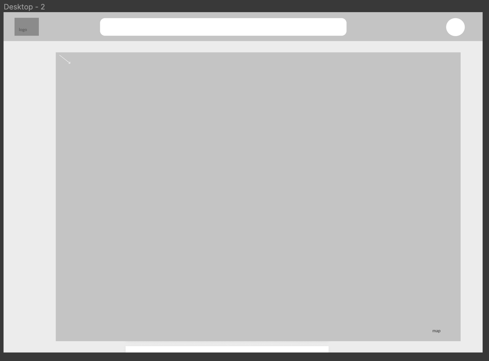
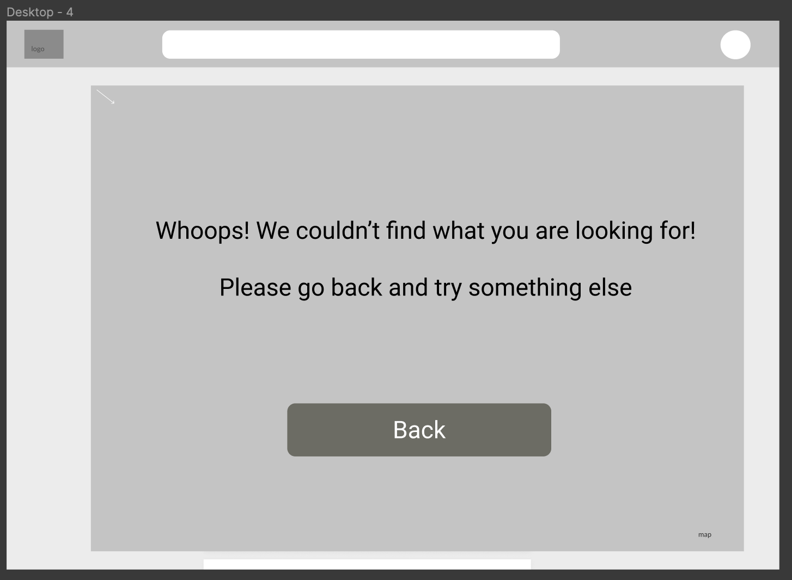

# Specification
Community Coders
K.Marshall, W.Hakim, M.Shiferaw, D.Vidyarthi, Y.Kim

## Problem :

Many local businesses are rapidly losing customers. Currently, there are only a few
organizations that are dedicated to local businesses to be noticed. While platforms like Yelp 
and Opentable allows users to find businesses, these services don't solely focus
on local businesses and often only support the top rated businesses that have the resources to advertise. 
Often times, businesses that are just starting or aren't as well known often end up failing because they
don't have enough customer outreach.

## Solution :

For our solution, we are envisioning a website where a business can create an account
where they will be able to post events, pictures, and promotions to a public feed.
Our solution both provides businesses a platform to post and create awareness to
users in the Seattle Area, as well as provide consumers a platform to find and
support their local businesses. In our solution, we have three main features: a
feed for business postings, business profiles, and an interactive map.

**Business Posting Feed**
Users will first be presented with a page that has a feed of posts from local
businesses within their area and set radius. Within this page, users can see postings,
see a map of where businesses are, and will be presented with a side bar of featured
businesses. The user can click on the business icon or the name to navigate to
the business profile.

**Business Profiles**
The main interaction on this platform would be allowing the user to see the profile
of a small, local business which would include information about the business and
other important information for the user. The business profiles will be found by the
user by either using the search bar or clicking on the name of a the business within
the feed. These profiles are used as an overview of the business to provide the user
basic information to allow the user to determine their interest in the business and
to allow them to visit or buy from the business.

**Business Location Map**
The last main feature is a map to inform users of small businesses near them. Users
can scroll through the map to find different businesses near their location. By
clicking on the map in the corner, it will expand to the fit the screen
so the user can get a better view. On the map, the business will be pinned with an icon. 

**Additional Features**
In addition, we will also have a newsfeed where the businesses can share new information or any
new events coming up and based on these posts we will provide featured businesses
for the user on the side. Users will be able to interact with the
newsfeed of small businesses by liking or commenting on the different posts.

Lastly, we will have a search box to allow users to search by keyword and also a
filter box for users to filter by location, price, or type of business.

**Error States**
There are two main reasons that a user would trigger an error state: a business is
not found or out of area and if the user is in an area that is not yet supported
(we are initially only supporting businesses found in King County). When a user does
produce this error, they are prompted with a error message and told to navigate back.

